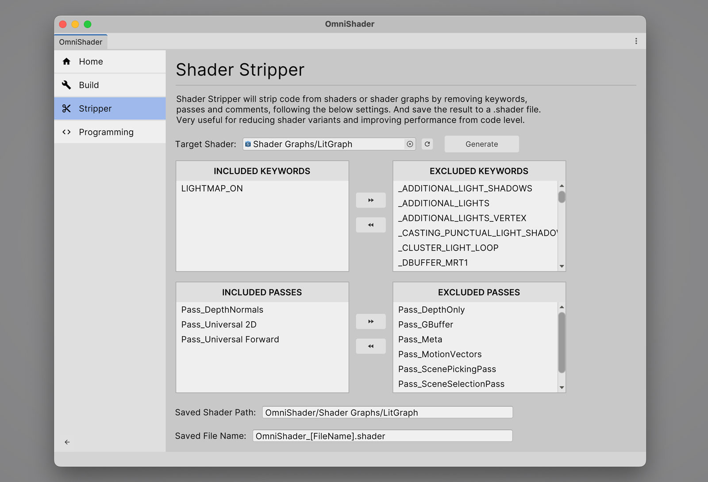

# Omni Shader Tools for Unity

Welcome to Omni Shader!

This is Unity Editor extension part of Omni Shader Tools For Unity.

Omni Shader Tools For Unity is a powerful toolset for Unity developers, designed to streamline shader development and enhance your workflow. 

Below are features of this tools.

### Shader Build Settings

Configure the rules that define what shaders or shader variants should be skipped when building to improve the build time and performance.

### Shader Stripper

Shader Stripper will strip code from shaders or shader graphs by removing keywords, passes and comments, following the below settings. And save the result to a .shader file.Very useful for reducing shader variants and improving performance from code level.

## Unity Version Support

Supports Unity 2021.3+